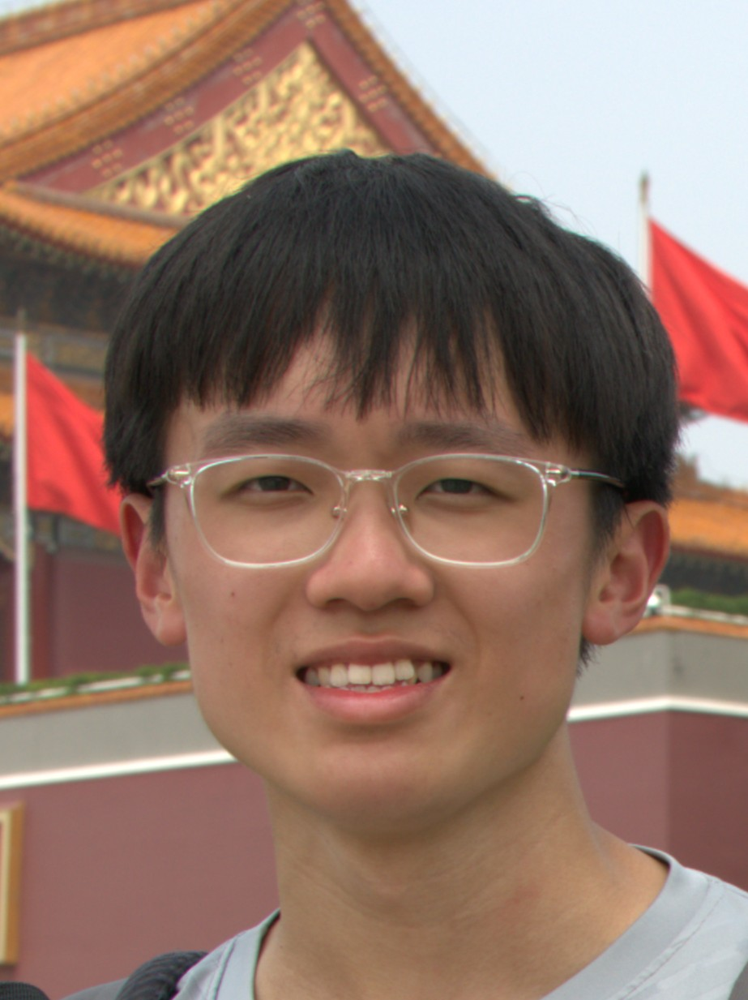
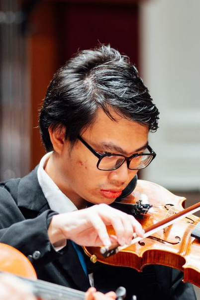

# About Us

We are a team based in the [School of Computing, National University of Singapore](http://www.comp.nus.edu.sg).

You can reach us at the email `seer[at]comp.nus.edu.sg`

## Project team

### Lin Haoyue

[[github](https://github.com/hylinny)]
[[portfolio](team/hylinny.md)]

* Role: Developer

### Fang Han

[[github](https://github.com/Eilyss)]
[[portfolio](team/fanghan.md)]

* Role: Developer

### Di Heng

[[github](http://github.com/grenn24)]
[[portfolio](team/diheng.md)]

* Role: Developer
* Responsibilities: Data Collection, Data Analysis

### Shriniket Subramanian

[[github](http://github.com/shriniket03)]
[[portfolio](team/shriniket03.md)]

* Role: Developer
* Responsibilities: Develop Functionality/UI

### Florian Viorel Tanely

[[github](http://github.com/iZUMi-kyouka)]
[[portfolio](team/izumi_kyouka.md)]

* Role: Developer
* Responsibilities: Software Testing and UI Design
