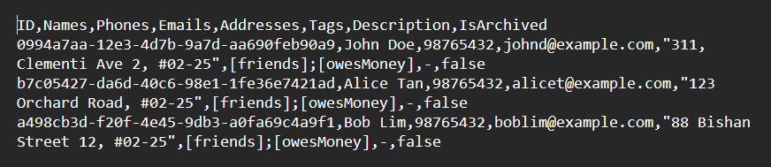

# TalentNexus User Guide

TalentNexus is a **desktop app for managing recruits**, optimized for use via a Command Line Interface (CLI) while still having the benefits of a Graphical User Interface (GUI). For avid keyboard users, TalentNexus can get contact management tasks done faster than traditional GUI apps.

<!-- * Table of Contents -->
<page-nav-print />

### Target Audience

TalentNexus is designed for **recruiters and HR professionals** who:
- Recruit internationally from a large and diverse talent pool
- Favour a quick, keyboard-driven interface for efficient management

### A few things to take note
- Basic familiarity with command-line (keyboard-based) operations
- Sufficient permissions to access and modify files on the computer
- Java 17 is installed on the computer (Don’t worry! Installation instructions are provided below)
- A stable internet connection to download Java or view additional resources, although TalentNexus itself runs offline

<div style="
  background: linear-gradient(135deg, #e8f5e9, #c8e6c9);
  border-left: 6px solid #43a047;
  padding: 12px 16px;
  border-radius: 10px;
  font-family: 'Segoe UI', system-ui, sans-serif;
  color: #1b5e20;
  box-shadow: 0 2px 6px rgba(0,0,0,0.1);
">
  <strong>Glossary:</strong>
  <ul style="margin-top: 4px; padding-left: 20px; color: #1b5e20;">
    <li><strong>Command Line Interface (CLI):</strong> Interact with the app by typing commands on a keyboard. Preferred by users who are familiar with keyboard commands and value speed.</li>
    <li><strong>Graphical User Interface (GUI):</strong> Interact with the app using visual elements like buttons, menus, and windows. Easier for users who prefer point-and-click interactions.</li>
  </ul>
</div>

--------------------------------------------------------------------------------------------------------------------

## Quick start

1. **Ensure Java `17` or above is installed on the computer.**
   ### Mac Users
   **Check if Java 17 is installed**
    1. Open Terminal.
    2. Run:
       ```bash
       java -version
       ```
    3. If the output shows `17` or above, skip the installation.

   **Install Java 17 (if not installed)**
    1. Run the following commands in Terminal:
       ```bash
       curl -s "https://get.sdkman.io" | bash
       source "$HOME/.sdkman/bin/sdkman-init.sh"
       sdk install java 17.0.14.fx-zulu
       sdk default java 17.0.14.fx-zulu
       ```
    2. Verify installation:
       ```bash
       java -version
       ```

   ### Windows Users

   **Check if Java 17 is installed**
    1. Open Command Prompt.
    2. Run:
       ```cmd
       java -version
       ```
    3. If the output shows `17` or above, skip the installation.

   **Install Java 17 (if not installed)**
    1. Download Java 17 from [Adoptium Temurin 17](https://adoptium.net/temurin/releases/?version=17) or [Oracle JDK 17](https://www.oracle.com/java/technologies/javase/jdk17-archive-downloads.html).
    2. Run the installer and follow the instructions.
    3. Verify installation:
       ```cmd
       java -version
       ```

   ### Linux Users

   **Check if Java 17 is installed**
    1. Open Terminal.
    2. Run:
       ```bash
       java -version
       ```
    3. If the output shows `17` or above, skip the installation.

   **Install Java 17 (if not installed)**
    1. Run the following commands in Terminal:
       ```bash
       sudo apt update
       sudo apt install openjdk-17-jdk
       ```
    2. Verify installation:
       ```bash
       java -version
       ```
<br>
<div style="background: linear-gradient(135deg, #e0f7fa, #b2ebf2); border-left: 6px solid #00acc1; padding: 12px 16px; border-radius: 10px; font-family: 'Segoe UI', system-ui, sans-serif; color: #004d40; box-shadow: 0 2px 6px rgba(0,0,0,0.1);">
  <strong>Tip:</strong> Java 17 is required for TalentNexus to run correctly. If multiple Java versions are installed, ensure that Java 17 is set as the default version.
</div>
<br>

2. Download the latest `.jar` file from [here](https://github.com/AY2526S1-CS2103T-F09-3/tp/releases).

3. Copy the file to the folder to be designated as the **home folder** for TalentNexus.

4. Open a command terminal, navigate to the folder where the .jar file is saved using the `cd` command and run the command `java -jar TalentNexus.jar`.<br>
   A GUI similar to **Figure 1** should appear in a few seconds.<br>


   **Figure 1:** Screenshot of the TalentNexus app

<br>

<div style="
  background: linear-gradient(135deg, #e8f5e9, #c8e6c9);
  border-left: 6px solid #43a047;
  padding: 12px 16px;
  border-radius: 10px;
  font-family: 'Segoe UI', system-ui, sans-serif;
  color: #1b5e20;
  box-shadow: 0 2px 6px rgba(0,0,0,0.1);
">
  <strong>Glossary:</strong>
  <ul style="margin-top: 4px; padding-left: 20px; color: #1b5e20;">
   <li><strong>Home Folder:</strong> The folder on the computer where the TalentNexus `.jar` file and its data files. This folder acts as the main workspace for the app.</li>
<li><strong>cd (change directory):</strong> A command used in the command-line interface to navigate between folders on the computer. For example, `cd /path/to/folder` enters the specified folder.</li></ul>
</div>
<br>
5. Type any command in the command box and press Enter to execute it. e.g. typing **`help`** and pressing Enter will open the help window.<br>
   Some example commands:

  * [`help`](#viewing-help--help) : Shows help information.
  * [`list`](#listing-all-recruits--list) : Lists all recruits.
  * [`add`](#adding-a-recruit-add) `n/John Doe p/98765432 e/johnd@example.com a/John street, block 123, #01-01` : Adds a recruit named `John Doe` to the Address Book.
  * [`edit`](#editing-a-recruit--edit) `1 p/91234567` : Edits the phone number of the 1st recruit.
  * [`find`](#locating-recruits-by-name-find) `John` : Finds recruits with "John" in their name.
  * [`delete`](#deleting-a-recruit--delete) `3` : Deletes the 3rd recruit shown in the current list.

6. Refer to the [Features](#features) section below for details of each command.

--------------------------------------------------------------------------------------------------------------------

## Command Summary

Action        | Format, Examples
--------------|-----------------------------------------------------------------------------------------------------------------------------------------------------------------------------------------
[**Add**](#adding-a-recruit-add)                | `add n/NAME... [p/PHONE_NUMBER]... [e/EMAIL]... [a/ADDRESS]... [d/DESCRIPTION] [t/TAG]...​` <br> e.g., `add n/James Ho p/22224444 e/jamesho@example.com a/123, Clementi Rd, 1234665 t/friend t/colleague`
[**Edit**](#editing-a-recruit-edit)             | `edit INDEX\|UUID OPERATION [n/NAME]... [p/PHONE_NUMBER]... [e/EMAIL]... [a/ADDRESS]... [d/DESCRIPTION] [t/TAG]...​`<br> e.g.,`edit 2 -ap n/James Lee e/jameslee@example.com`
[**View**](#viewing-a-recruit-view)             | `view INDEX\|UUID`<br> e.g., `view 2`
[**Delete**](#deleting-a-recruit-delete)        | `delete INDEX\|UUID`<br> e.g., `delete 3`
[**Find**](#searching-for-recruits-find)     | `find NAME [-id KEYWORDS] [-n KEYWORDS] [-p KEYWORDS] [-e KEYWORDS] [-a KEYWORDS] [-t KEYWORDS]`<br> e.g., `find James Jake`
[**Sort**](#sorting-recruits-sort)             | `sort  [-n ORDER] [-p ORDER] [-e ORDER] [-a ORDER]`<br> e.g., `sort`, `sort desc`, `sort n/ asc p/ desc`
[**List**](#listing-all-recruits-list)          | `list [-archived] [-all]`<br> e.g., `list`, `list -archived`, `list -all`
[**Archive**](#archiving-a-recruit-archive)     | `archive INDEX`<br> e.g., `archive 2`
[**Unarchive**](#unarchiving-a-recruit-unarchive) | `unarchive INDEX`<br> e.g., `unarchive 1`
[**Undo**](#undoing-previously-done-operations-undo) | `undo`
[**Redo**](#redoing-undone-operations-redo) | `redo`
[**Export**](#exporting-recruit-data-export)    | `export [FILEPATH]`<br> e.g., `export ./data/recruits.csv`
[**Clear**](#clearing-all-entries-clear)        | `clear -confirm`
[**Dismiss**](#dismissing-command-result-message-dismiss)                | `dismiss`
[**Help**](#viewing-help-help)                  | `help`

--------------------------------------------------------------------------------------------------------------------

## Command Format

* Words in `UPPER_CASE` are the parameters to be supplied by the user.<br>
  e.g. in `add n/NAME`, `NAME` is a parameter which can be used as `add n/John Doe`.

* Items in square brackets are optional.<br>
  e.g `n/NAME [t/TAG]` can be used as `n/John Doe t/friend` or as `n/John Doe`.

* Items with `…`​ after them can be used multiple times including zero times.<br>
  e.g. `[t/TAG]…​` can be used as ` ` (i.e. 0 times), `t/friend`, `t/friend t/family` etc.

* Parameters can be in any order.<br>
  e.g. if the command specifies `n/NAME p/PHONE_NUMBER`, `p/PHONE_NUMBER n/NAME` is also acceptable.

* Extra arguments for commands that do not take in parameters such as `help`, `list`, `exit` and `clear` **will be ignored**.<br>
  e.g. If the user types `help 123`, it will be interpreted as `help`.

* When using the PDF versions of the user guide, be careful when copying and pasting commands that span multiple lines as space characters surrounding line-breaks may be omitted when copied over to the application.

* `UUID` vs `INDEX`: `UUID` refers to UUID, which is a randomly-generated, unique identifier to identify a unique recruit. UUID is in the form of something like `77da2944-2102-429c-946d-bad6c33c1fe1`. `INDEX` refers to the index number shown to the left of a recruit's name. The index number of a recruit can change depending on various factors such as the order that the recruits are sorted, and whether archived recruits are being listed too.

* The pipe symbol `|` denotes "or" when used in command format. Unless otherwise stated, you may only choose one parameter type to specify **but not both**.<br>
  e.g. `view INDEX|UUID` means you can pass in either a recruit's id or index right after the command word `view`, **but not both**.
  * This means `view 1` and `view 74ce96b7-5249-4368-815f-c5a927ed5b0d` are accepted, but `view 1|74ce96b7-5249-4368-815f-c5a927ed5b0d` is **not accepted**.

* If any of the data fields contains special characters like `-` or `/`, the **command may not be parsed correctly** as
  these characters are used as prefixes in other commands. Instead, surround the field with quotation marks `"`,
  `"like this"` to ensure that the data is handled correctly. <br>
  e.g. `add n/"Anne-Marie"` or `add n/"Nurul a/p Rahman"`
  * If within the quotation marks `"` you want to use `\` or `"`, place the character `\` before it to "escape" it, which
    basically tells the program that you want to input these special characters. <br>
    e.g. `add n/"\"Maria del Carmen\" Pérez"` or `add n/Ned d/"This is a backslash \\"`

</box>

<br>

### Viewing help: `help`

* Directs users to the online user guide for detailed instructions
* Displays a complete list of all available commands in the app (see **Figure 2**)


**Figure 2:** Help message pop-up

Format: `help`

<br>

### Adding a recruit: `add`

Adds a recruit to the address book.

* More than one recruit attribute, such as names and email addresses, may be specified.
* If more than one data item exists for a particular attribute, the first one will be set as the primary data.
* If only one data item exists for a particular attribute, this data will be considered the primary data.
* Names may also be provided in various languages.

Format: `add n/NAME... [p/PHONE_NUMBER]... [e/EMAIL]... [a/ADDRESS]... [d/DESCRIPTION]... [t/TAG]...​`

<div style=" background: linear-gradient(135deg, #e0f7fa, #b2ebf2); border-left: 6px solid #00acc1; padding: 12px 16px; border-radius: 10px; font-family: 'Segoe UI', system-ui, sans-serif; color: #004d40; box-shadow: 0 2px 6px rgba(0,0,0,0.1); "> <strong>Tip:</strong> A recruit can have any number of tags (or none at all)</div>
<br>

Examples:
* `add n/John Doe p/98765432 e/johnd@example.com a/John street, block 123, #01-01`
* `add n/Jenny Mantle p/66612873 e/jenneram@example.com a/Shadow maze, block 3, #01-01 d/Considered a friend inside t/boss`
* `add n/Betsy Crowe t/friend e/betsycrowe@example.com a/Newgate Prison p/1234567 t/criminal`
* `add n/田中小泉 n/Max e/koizumi@example.com e/max@example.com a/30 Princess Gina Park t/swe t/test_engineer`

<br>

### Listing all recruits: `list`

Shows a list of all unarchived recruits in the address book. (archived recruits are hidden from the list)

Format: `list`

* **Only the primary git attributes** for each recruit will be shown in the recruit list.
  * For example, if a recruit has two names, John and Johnny, and two phones, 12341234 and 56785678, only Johnny and 12341234 will be shown, assuming this recruit's primary name and phone is Johnny and 12341234 respectively.
* View may also view [**archived**](#archiving-a-recruit--archive) recruits by passing in `-archived` or `-all` as shown belo:

**Formats:**
* `list` — Shows only unarchived (active) recruits (default)
* `list -archived` — Shows only archived recruits
* `list -all` — Shows all recruits (both archived and unarchived)


<br>

### Viewing a recruit: `view`

View the recruit located at the a particular index from the address book.

Format: `view INDEX|UUID`

* Displays the full details of the recruit at the specified `INDEX` or `UUID` in the recruit list.
* The index refers to the index number shown in the displayed recruit list.
* The index **must be a positive integer** 1, 2, 3, …​

Examples:
* `list` followed by `view 2` displays the 2nd recruit in the address book.
* `find Betsy` followed by `view 1` displays the 1st recruit in the results of the `find` command.

<br>

### Editing a recruit: `edit`

Edits an existing recruit in the address book.

Format: `edit INDEX|UUID OPERATION [n/NAME]... [p/PHONE]... [e/EMAIL]... [a/ADDRESS]... [d/DESCRIPTION]... [t/TAG]…​`

* Edits the recruit at the specified `INDEX` or `UUID`.
* Performs the specified `OPERATION`, which can be append, overwrite, or remove to the specified attributes. If `OPERATION` is missing, the command is implicitly treated as an **overwrite** command.
* The index refers to the index number shown in the displayed recruit list. The index **must be a positive integer** 1, 2, 3, …​
* At least one of the optional fields must be provided.
* Existing values will be updated to the input values.
* Recruit’s tags can be removed by typing `t/` without specifying any tags after it.
* All of the recruit’s tags can be removed by typing t/ without specifying any tags afterward.
* When OPERATION is update primary, at most one data item for each attribute may be specified, and this data must be present.

#### Operation Types

The edit command can perform three types of operation: append, remove, and overwrite.
* Append (`-ap`) operation adds the specified attributes to the existing list of attributes.
* Remove (`-rm`) operation removes the specified attributes from the existing list of attributes.
* Overwrite (`-o`) operation overwrites existing values of all the specified attributes.
* Update primary (`-primary`) operation updates the primary data for the specified attributes.

Examples:
*  `edit 1 p/91234567 e/johndoe@example.com` edits the phone number and email address of the 1st recruit to be `91234567` and `johndoe@example.com` respectively.
*  `edit 2 n/Betsy Crower t/` edits the name of the 2nd recruit to be `Betsy Crower` and clears all existing tags.
*  `edit 3 -ap e/e01234567@u.nus.edu e/dcsat@nus.edu.sg a/1 Computing Drive` adds to the 3rd recruit the email addresses `e01234567@u.nus.edu.sg` and `dcsat@nus.edu.sg`, and the address `1 Computing Drive`.
*  `edit 2 -rm n/花沢かな e/hanazawa@example.com t/seiyuu` removes from the 2nd recruit the name `花沢かな`, the email `hanazawa@example.com`, and the tag `seiyuu`.
*  `edit 4 -o p/80135815 p/94647894 n/Lawrence Wonk n/ローレンスヲン` edits the names of the 4th recruit to include only `Lawrence Wonk` and `ローレンスヲン`, and the phone numbers to include only `80135815` and `94647894`.
*  `edit -primary 2 p/98989898 n/Dwayne "Ping Qilin" Johnsson` updates the 2nd recruit's primary phone number to `98989898` and the primary name to `Dwayne "Ping Qilin" Johnsson`, assuming that this phone number and name exist.

<br>

### Deleting a recruit: `delete`

Deletes the specified recruit from the address book.

Format: `delete INDEX|UUID`

* Deletes the recruit at the specified `INDEX` or `UUID`.
* The index refers to the index number shown in the displayed recruit list.
* The index **must be a positive integer** 1, 2, 3, …​

Examples:
* `list` followed by `delete 2` deletes the 2nd recruit in the address book.
* `find Betsy` followed by `delete 1` deletes the 1st recruit in the results of the `find` command.

<br>

### Undoing previously done operations: `undo`

Undoes operations that were done recently.

*  Undo operations can only be executed consecutively up to 200 times.

Format: `undo​`

Example usage scenarios:
- Recruit Li is deleted
- The user accidentally clears all recruits
- The undo command is executed to restore all the recruits
- The user realised that recruit Lee was meant to be deleted instead of Li
- The undo command is executed again to undo deletion of recruit Li

<br>

### Redoing undone operations: `redo`

Redoes operations that were undone recently.

<div style=" background: linear-gradient(135deg, #fff3e0, #ffe0b2); border-left: 6px solid #fb8c00; padding: 12px 16px; border-radius: 10px; font-family: 'Segoe UI', system-ui, sans-serif; color: #5d4037; box-shadow: 0 2px 6px rgba(0,0,0,0.1); "> <strong>Warning:</strong> If any operations have been undone and changes to a recruit are subsequently made, the previously undone operations cannot be redone.</div>

Format: `redo`

Examples usage scenario:
- Recruit Li is deleted
- The user adds another recruit
- The user wants to check the email of the previously deleted recruit Li.
- The undo command is executed **2 times** to undo the deletion of recruit Li and check the email
- The redo command is executed **2 times** to redo the deletion of recruit Li

<br>

### Searching for recruits: `find`

Finds all recruits whose details match any of the given keywords.

Format: `find NAME [-id KEYWORDS] [-n KEYWORDS] [-p KEYWORDS] [-e KEYWORDS] [-a KEYWORDS] [-t KEYWORDS]`

* The `NAME` keyword(s) take precedence

* The flag `-` preceding `KEYWORDS` specifies the field(s) to search under:
    * `-id` — Search by UUID
    * `-n` — Search by Name
    * `-p` — Search by Phone
    * `-e` — Search by Email
    * `-a` — Search by Address
    * `-t` — Search by Tag

* The search is **case-insensitive**

* Multiple keywords can be separated by the pipe symbol (`|`). Note that the use of the pipe symbol here differs from what is explained at the start of the "Command Format" section (see below).

* If no flag is provided, the app searches using `NAME` keywords by default

* If multiple search criteria are provided, the result will include all recruits who satisfy them

**Shorthand formats:**
* `find alice` — Finds recruits whose name contains “alice” (case-insensitive)
* `find -n alice|bob|charlie` — Finds recruits whose name contains **“alice”**, **“bob”**, or **“charlie”**
* `find -a Clementi|Tampines` — Finds recruits whose address contains **“Clementi”** or **“Tampines”**
* `find -t volunteer|intern|cleaner` — Finds recruits tagged as **“volunteer”** or **“intern”** or **"cleaner"**
* `find -p 98765432|91234567` — Finds recruits whose phone number contains **“98765432”** or **“91234567”**
* `find -e gmail|hotmail` — Finds recruits whose email contains **“gmail”** or **“hotmail”**

**Chaining multiple flags:**
* `find -n alice|bob -a Clementi|Jurong` — Finds recruits whose **name** contains “alice” or “bob”, **and** whose
* **address** contains “Clementi” or “Jurong”
* `find -n alice -p 98765432|91234567` — Finds recruits whose **name** contains “alice” and whose **phone** matches either number
* `find -t intern|fulltime -a Bukit|Pasir` — Finds recruits tagged as “intern” or “fulltime”, and whose address contains
  “Bukit” or “Pasir”

**Examples:**
* `find alice` — Finds all recruits with “alice” in their name
* `find -n alice|bob|charlie` — Finds recruits whose name matches “alice”, “bob”, or “charlie”
* `find -a Clementi|Tampines -p 98765432|91234567` — Finds recruits with “Clementi” or “Tampines” in their address, and whose phone numbers contain “98765432” or “91234567”
* `find -t volunteer|member -e gmail` — Finds recruits tagged as “volunteer” or “member”, and with a Gmail address
* `find -id 123|456|789` — Finds recruits whose UUID contains “123”, “456”, or “789”

<div style="white-space: pre-wrap; background: linear-gradient(135deg, #e0f7fa, #b2ebf2); border-left: 6px solid #00acc1; padding: 12px 16px; border-radius: 10px; font-family: 'Segoe UI', system-ui, sans-serif; color: #004d40; box-shadow: 0 2px 6px rgba(0,0,0,0.1); "> <strong>Tip:</strong> Use the pipe symbol  |  to combine multiple search keywords, and use multiple flags to search across different fields. </div>

<br>


**Figure 3:** Searching for recruits with "Bukit Batok" in their address


**Figure 4:** Searching for recruits whose name contains either "Johnathon" or "Ben"

<br>

### Sorting recruits: `sort`

Sorts all recruits in the address book by specified fields in ascending or descending order.

Format: `sort [PARAMETER ORDER]...`

* `PARAMETER` includes `-n` for name, `-p` for phone, `-e` for email, and `-a` for address.
* `ORDER` can be either `asc` (ascending) or `desc` (descending).
* Multiple fields can be specified, and the sorting will be applied in order of priority from left to right.
* If no parameters and orders are provided, recruits will be sorted by name in ascending order by default.
* If only `asc` or `desc` is provided (without field prefixes), recruits will be sorted by name in that order.
* For any parameter, if the order is not specified, recruits will be sorted in ascending order by default.
* The sort is case-insensitive for text fields (name, email, address).

**Shorthand formats:**
* `sort` - Sorts by name in ascending order
* `sort asc` - Sorts by name in ascending order
* `sort desc` - Sorts by name in descending order

Examples:
* `sort` - Sorts all recruits by name in ascending order (A to Z)
* `sort desc` - Sorts all recruits by name in descending order (Z to A)
* `sort -n asc` - Sorts all recruits by name in ascending order
* `sort -p desc` - Sorts all recruits by phone number in descending order
* `sort -n asc -p desc` - Sorts by name (ascending) first, then by phone number (descending) for recruits with the same name
* `sort -e asc -a desc` - Sorts by email (ascending) first, then by address (descending) for recruits with the same email
* `sort -n -p desc` - Sorts by name (ascending) first, then by phone number (descending) for recruits with the same name
* `sort -n -e` - Sorts by name (ascending) first, the by email (ascending) for recruit with the same name

<div style=" background: linear-gradient(135deg, #e0f7fa, #b2ebf2); border-left: 6px solid #00acc1; padding: 12px 16px; border-radius: 10px; font-family: 'Segoe UI', system-ui, sans-serif; color: #004d40; box-shadow: 0 2px 6px rgba(0,0,0,0.1); "> <strong>Tip:</strong> Use multiple sort criteria to organise recruits more precisely. The leftmost field has the highest priority.</div>

<br>

### Archiving a recruit: `archive`

Archives a recruit to hide them from the default list view while preserving their information.

**Format:** `archive INDEX|UUID`

**Parameters:**
* `INDEX` — The index number shown in the displayed recruit list
* `UUID` — The UUID of the recruit to archive
* The index **must be a positive integer** 1, 2, 3, …​

**What is archiving?**
* Archived recruits are hidden from the default [**`list`**](#listing-all-recruits--list) view but remain in the system
* Use this feature to organize inactive or past recruits without deleting their data
* View archived recruits using `list -archived` or `list -all`

**Examples:**
* `list` followed by `archive 2` archives the 2nd recruit in the address book
* `find John` followed by `archive 1` archives the 1st recruit in the results of the `find` command

<div style=" background: linear-gradient(135deg, #e0f7fa, #b2ebf2); border-left: 6px solid #00acc1; padding: 12px 16px; border-radius: 10px; font-family: 'Segoe UI', system-ui, sans-serif; color: #004d40; box-shadow: 0 2px 6px rgba(0,0,0,0.1); "> <strong>Tip:</strong> Archive recruits no longer active to keep the main list clean and focused!</div>

<br>

### Unarchiving a recruit: `unarchive`

Unarchives a previously [**archived**](#archiving-a-recruit--archive) recruit to restore them to the active recruit list.

**Format:** `unarchive INDEX|UUID`

**Parameters:**
* `INDEX` — The index number shown in the displayed recruit list (must be viewing archived recruits)
* `UUID` — The UUID of the recruit to unarchive
* The index **must be a positive integer** 1, 2, 3, …​

**Examples:**
* `list -archived` followed by `unarchive 1` unarchives the 1st recruit in the archived list
* `list -all` followed by `unarchive 3` unarchives the 3rd recruit if they are archived

<div style=" background: linear-gradient(135deg, #e0f7fa, #b2ebf2); border-left: 6px solid #00acc1; padding: 12px 16px; border-radius: 10px; font-family: 'Segoe UI', system-ui, sans-serif; color: #004d40; box-shadow: 0 2px 6px rgba(0,0,0,0.1); "> <strong>Tip:</strong> To unarchive a recruit, first use `list -archived` to view archived recruits, then use `unarchive INDEX`.</div>

<br>

### Exporting recruit data: `export`

Export all recruits in the address book to a .csv file.

Format: `export FILEPATH`

* `FILEPATH` is optional, if none is given the default filepath found in preferences.json will be used.

Examples:
*  `export` Exports all recruits to the default filepath found in preferences.json.
*  `export ./data/recruits.csv` Exports all recruits to the relative filepath `./data/recruits.csv`.

<div style=" background: linear-gradient(135deg, #e0f7fa, #b2ebf2); border-left: 6px solid #00acc1; padding: 12px 16px; border-radius: 10px; font-family: 'Segoe UI', system-ui, sans-serif; color: #004d40; box-shadow: 0 2px 6px rgba(0,0,0,0.1); "> <strong>Tip:</strong> Use CSV exports to share data easily between users, or to view it in a spreadsheet software like Excel.</div>

<br>


**Figure 5:** Exported recruits list in .csv format from TalentNexus

<br>

### Clearing all entries: `clear`

Clears all entries from the address book.

Format: `clear -confirm`

* The `-confirm` flag is required to confirm deletion of all recruits.
* When `-confirm` is not specified, this command will simply display a help message.

<div style=" background: linear-gradient(135deg, #e0f7fa, #b2ebf2); border-left: 6px solid #00acc1; padding: 12px 16px; border-radius: 10px; font-family: 'Segoe UI', system-ui, sans-serif; color: #004d40; box-shadow: 0 2px 6px rgba(0,0,0,0.1); "> <strong>Tip:</strong> If recruits have been cleared accidentally, don't worry! Use the <em>undo</em> command immediately to restore previous changes</div>

<br>

### Dismissing command result message: `dismiss`

Clears the message shown after executing a command.

Format: `dismiss`

<div style=" background: linear-gradient(135deg, #e0f7fa, #b2ebf2); border-left: 6px solid #00acc1; padding: 12px 16px; border-radius: 10px; font-family: 'Segoe UI', system-ui, sans-serif; color: #004d40; box-shadow: 0 2px 6px rgba(0,0,0,0.1); "> <strong>Tip:</strong> Dismiss command result message that have been read to regain more space to view the recruit list.</div>

<br>

### Exiting the program: `exit`

Exits the program.

Format: `exit`

### Saving the data

Recruit data is saved automatically after any command is executed. There is no need to save manually.

### Editing the data file

Recruit data is saved automatically as a JSON file `[JAR file location]/data/TalentNexusData.json`. Advanced users are welcome to update data directly by editing that data file.

<div style="
  background: linear-gradient(135deg, #fff3e0, #ffe0b2);
  border-left: 6px solid #fb8c00;
  padding: 12px 16px;
  border-radius: 10px;
  font-family: 'Segoe UI', system-ui, sans-serif;
  color: #5d4037;
  box-shadow: 0 2px 6px rgba(0,0,0,0.1);
">
  <strong>Warning:</strong>
  <ul style="
    margin: 8px 0 0 20px;
    padding: 0;
    color: #5d4037; /* ensures list text matches div */
    background: transparent; /* makes sure gradient shows through */
  ">
    <li>If there are changes to the data file which made its format invalid, TalentNexus will discard all data and start with an empty data file at the next run. Hence, it is <strong>strongly recommended</strong> to take a backup of the file before editing it.</li>
    <li>Furthermore, certain edits can cause TalentNexus to behave in unexpected ways (e.g., if a value entered is outside the acceptable range).</li>
    <li>Therefore, edit the data file while making sure it adheres to the stored format.</li>
  </ul>
</div>

---

## FAQ

**Q**: How do I transfer my data to another Computer?<br>
**A**: First, install TalentNexus on the new computer. Then, locate the `TalentNexusData.json` file in the `/data` folder of your current installation and copy it over to the same location on the new machine, replacing the existing file.
---

**Q:** Can I use TalentNexus without an internet connection?
**A:** Yes. TalentNexus is a fully offline desktop application. No internet connection is required to use any of its features.

---

**Q:** What happens if I accidentally delete a recruit?
**A:** Deleted recruits can be restored immediately using the `undo` command (`undo`), as long as the application has not been closed since the deletion.

---

**Q:** How do I back up my data?
**A:** Copy the `TalentNexusData.json` file located in the `/data` folder (in the same directory as the `.jar` file). Store this backup in a safe place (cloud storage, external drive, etc.).

---

**Q:** Can I import data from another AddressBook or TalentNexus installation?
**A:** Yes. Copy the `TalentNexusData.json` file from the other installation into the current `/data` folder, replacing the existing file. **Always back up** the current `TalentNexusData.json` file first.

---

**Q:** Why are my changes not appearing after restarting the app?
**A:** This can happen if the app is executed from a different file directory or the data file has been moved. Make sure the `TalentNexusData.json` file is placed in the `/data` folder.

---

**Q:** What if I enter invalid recruit data inside the data file?
**A:** TalentNexus always validates the data file on startup. If the file format is invalid, the app may reset the data file. Always back up the data file before making manual edits to it.

---

**Q:** How do I view archived recruits?
**A:** Use `list -archived` to show only archived recruits, or `list -all` to view both archived and active recruits.

---

**Q:** What should I do if a command doesn’t work?
**A:** Check the command syntax against the [**Command summary**](#command-summary) and the relevant command section. Type `help` to view the quick command guide.

---

**Q:** How do I reset the application to its default state?
**A:** Delete both `preferences.json` and `TalentNexusData.json` files from the ./data folder. On next launch the app will recreate default files and sample data.

---

**Q:** How do I run TalentNexus with a specific Java version?
**A:** Ensure the desired JDK is installed and added to the computer's environment variables. Then, run the app with that Java version.

---

**Q:** Where can I find the JSON schema or data format?
**A:** The primary data file is `TalentNexusData.json` and stores recruits as JSON objects with fields such as `name`, `phone`, `email`, `address`, `tags`, `archived`, and `uuid`. To edit the file manually, back it up first and preserve the valid JSON and expected field types (arrays for multiple values like `email`/`phone`/`name`).

---

**Q:** The Help window opened off-screen or is minimized — what do I do?
**A:** Close the app and delete the `preferences.json` file in the ./data folder to reset window positions. Relaunch the app to restore windows to default locations.

---

**Q:** Is there a limit to how many operations I can undo?
**A:** There is a limit of up to 200 consecutive `undo` operations. Note that certain actions (like closing the app) may clear the undo history.

---

**Q:** Who do I contact for bug reports or feature requests?
**A:** Create an issue on the project repository (if using the upstream AddressBook/TalentNexus repo). Include reproducible steps, the `preferences.json` and `TalentNexusData.json` (sanitized if needed), and the Java version used.

---

**Q:** My computer has a different java version installed and the application is not launching as expected?
**A:** To switch to Java 17, first ensure it is installed by following the instructions [**here**](#quick-start). After installation, update your system’s **JAVA_HOME** environment variable to the Java 17 installation directory such that the **/bin** folder of Java 17 comes before other Java versions.
On Windows, this can be done via System Properties > Environment Variables; on macOS or Linux, update .bashrc, .zshrc, or .profile to export the correct paths. Finally, restart your terminal or IDE and run java -version to confirm Java 17 is now in use.
--------------------------------------------------------------------------------------------------------------------

## Known issues

1. **When using multiple screens**, if the application is moved to a secondary screen, and then switched to using only the primary screen, the GUI will open off-screen. The remedy is to delete the `preferences.json` file created by the application before running the application again.
2. **If the the Help Window** is minimised and the `help` command (or use the `Help` menu, or the keyboard shortcut `F1`) is run again, the original Help Window will remain minimized, and no new Help Window will appear. The remedy is to manually restore the minimized Help Window.
3. **When a Linux-based operating system such as Ubuntu and Linux Mint** is used, issues may be experienced when using an Input Method Editor (IME) to type in non-latin characters. For example, the window showing the candidate kanji characters when typing in Japanese may not show up. Unfortunately, this is a limitation of the technology we used to build this application. Commands requiring IME input can be typed in another text editing program and then copied into the command box.
4. When **certain Unicode characters** such as the rare CJK extension characters are used, the GUI may display one or more square boxes (□) instead of the intended character(s). This is due to the default system font not supporting those characters, and is a limitation of the underlying JavaFX text rendering.
--------------------------------------------------------------------------------------------------------------------
