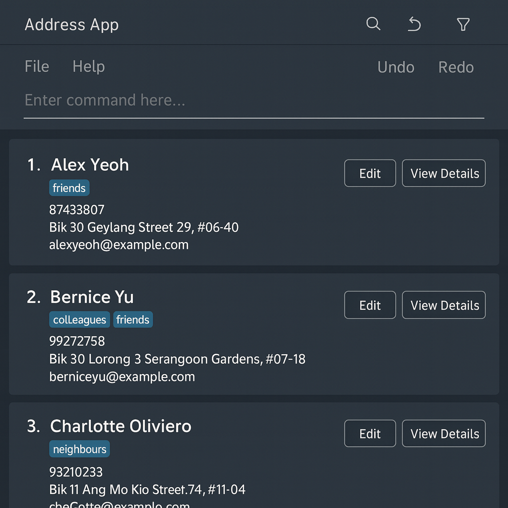
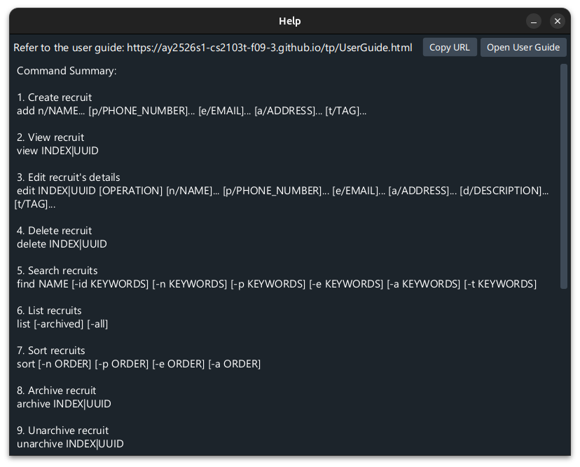
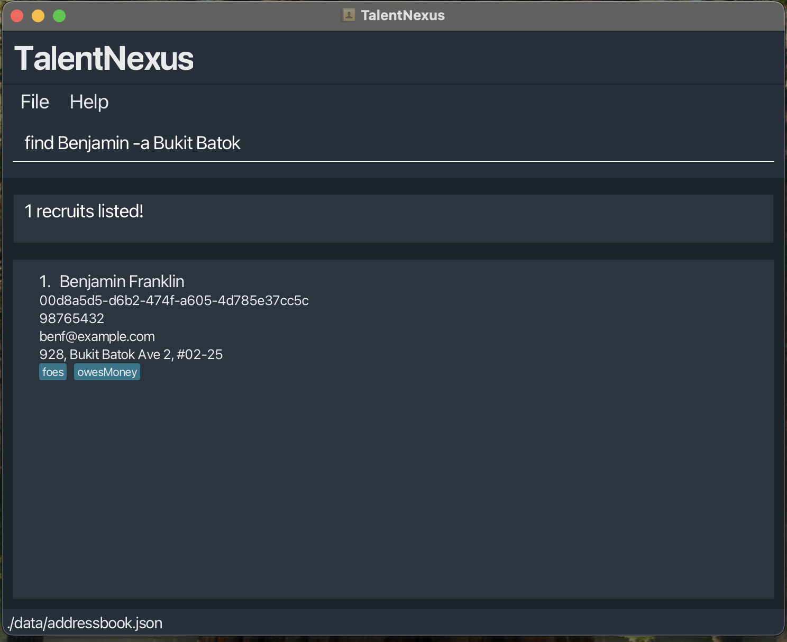
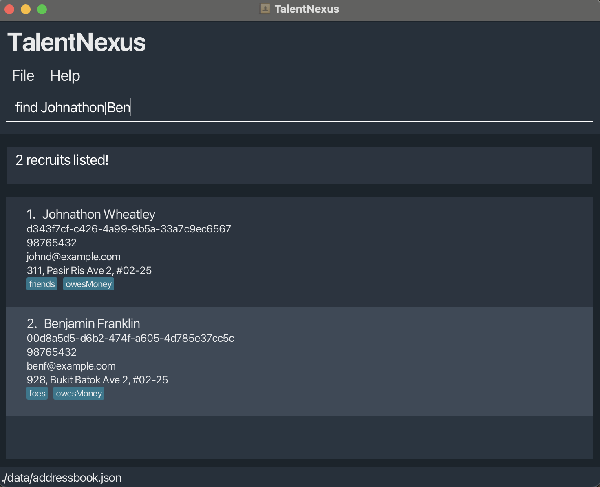

# TalentNexus User Guide

TalentNexus is a **desktop app for managing recruits, optimized for use via a  Line Interface** (CLI) while still having the benefits of a Graphical User Interface (GUI). If you can type fast, TalentNexus can get your contact management tasks done faster than traditional GUI apps.

<!-- * Table of Contents -->
<page-nav-print />

--------------------------------------------------------------------------------------------------------------------

## Quick start

1. Ensure you have Java `17` or above installed in your Computer. 
   **Mac users:** Ensure you have the precise JDK version prescribed [here](https://se-education.org/guides/tutorials/javaInstallationMac.html).

1. Download the latest `.jar` file from [here](https://github.com/se-edu/addressbook-level3/releases).

1. Copy the file to the folder you want to use as the _home folder_ for your AddressBook.

1. Open a command terminal, `cd` into the folder you put the jar file in, and use the `java -jar talentnexus.jar` command to run the application. 
   A GUI similar to the below should appear in a few seconds. Note how the app contains some sample data. 
   

1. Type the command in the command box and press Enter to execute it. e.g. typing **`help`** and pressing Enter will open the help window. 
   Some example commands you can try:

   * [`help`](#viewing-help--help) : Shows help information.

   * [`list`](#listing-all-recruits--list) : Lists all recruits.

   * [`add`](#adding-a-recruit-add) `n/John Doe p/98765432 e/johnd@example.com a/John street, block 123, #01-01` : Adds a recruit named `John Doe` to the Address Book.

   * [`view`](#viewing-a-recruit--view) `2` : Views the 2nd recruit in the address book.

   * [`edit`](#editing-a-recruit--edit) `1 p/91234567` : Edits the phone number of the 1st recruit.

   * [`find`](#locating-recruits-by-name-find) `John` : Finds recruits with "John" in their name.

   * [`sort`](#sorting-recruits--sort) : Sorts recruits by name in ascending order.

   * [`archive`](#archiving-a-recruit--archive) `2` : Archives the 2nd recruit.

   * [`unarchive`](#unarchiving-a-recruit--unarchive) `1` : Unarchives the 1st recruit.

   * [`delete`](#deleting-a-recruit--delete) `3` : Deletes the 3rd recruit shown in the current list.

   * [`export`](#exporting-data--export) : Exports all recruits to a CSV file.

   * [`clear`](#clearing-all-entries--clear) : Deletes all recruits.

   * [`exit`](#exiting-the-program--exit) : Exits the app.

1. Refer to the [Features](#features) below for details of each command.

--------------------------------------------------------------------------------------------------------------------

## Features

<box type="info" seamless>

**Notes about the command format:** 

* Words in `UPPER_CASE` are the parameters to be supplied by the user. 
  e.g. in `add n/NAME`, `NAME` is a parameter which can be used as `add n/John Doe`.

* Items in square brackets are optional. 
  e.g `n/NAME [t/TAG]` can be used as `n/John Doe t/friend` or as `n/John Doe`.

* Items with `…`​ after them can be used multiple times including zero times. 
  e.g. `[t/TAG]…​` can be used as ` ` (i.e. 0 times), `t/friend`, `t/friend t/family` etc.

* Parameters can be in any order. 
  e.g. if the command specifies `n/NAME p/PHONE_NUMBER`, `p/PHONE_NUMBER n/NAME` is also acceptable.

* Extraneous parameters for commands that do not take in parameters (such as `help`, `list`, `exit` and `clear`) will be ignored. 
  e.g. if the command specifies `help 123`, it will be interpreted as `help`.

* If you are using a PDF version of this document, be careful when copying and pasting commands that span multiple lines as space characters surrounding line-breaks may be omitted when copied over to the application.
</box>

### Viewing help : `help`

Shows a message explaining how to access the help page.

Format: `help`

### Adding a recruit: `add`

Adds a recruit to the address book.

* You may specify more than one recruit attributes like names and email addresses.
* You may also provide names in various langugaes.

Format: `add [n/NAME]... [p/PHONE_NUMBER]... [e/EMAIL]... [a/ADDRESS]... [d/DESCRIPTION]... [t/TAG]…​`

<box type="tip" seamless>

💡 **Tip:** A recruit can have any number of tags (or none at all)
</box>

Examples:
* `add n/John Doe p/98765432 e/johnd@example.com a/John street, block 123, #01-01`
* `add n/Jenny Mantle p/66612873 e/jenneram@example.com a/Shadow maze, block 3, #01-01 d/Considered a friend inside t/boss`
* `add n/Betsy Crowe t/friend e/betsycrowe@example.com a/Newgate Prison p/1234567 t/criminal`
* `add n/田中小泉 n/Max e/koizumi@example.com e/max@example.com a/30 Princess Gina Park t/swe t/test_engineer`

### Listing all recruits : `list`

Shows a list of all recruits in the address book.

Format: `list`

### Viewing a recruit : `view`

View the recruit located at the a particular index from the address book.

Format: `view INDEX/UUID`

* Displays the full details of the recruit at the specified `INDEX` or `UUID` in the recruit list.
* The index refers to the index number shown in the displayed recruit list.
* The index **must be a positive integer** 1, 2, 3, …​

Examples:
* `list` followed by `view 2` displays the 2nd recruit in the address book.
* `find Betsy` followed by `view 1` displays the 1st recruit in the results of the `find` command.

### Editing a recruit : `edit`

Edits an existing recruit in the address book.

Format: `edit INDEX/UUID OPERATION [n/NAME]... [p/PHONE]... [e/EMAIL]... [a/ADDRESS]... [d/DESCRIPTION]... [t/TAG]…​`

* Edits the recruit at the specified `INDEX` or `UUID`.
* Performs the specified `OPERATION`, which can be append, overwrite, or remove to the specified attributes. If `OPERATION` is missing, the command is implicitly treated as an **overwrite** command.
* The index refers to the index number shown in the displayed recruit list. The index **must be a positive integer** 1, 2, 3, …​
* At least one of the optional fields must be provided.
* Existing values will be updated to the input values.
* When editing tags, the existing tags of the recruit will be removed i.e adding of tags is not cumulative.
* You can remove all the recruit’s tags by typing `t/` without specifying any tags after it.

#### Flags
* `OPERATION`: `-ap` for append, `-rm` for remove, `-o` for overwrite.

Examples:
*  `edit 1 p/91234567 e/johndoe@example.com` Edits the phone number and email address of the 1st recruit to be `91234567` and `johndoe@example.com` respectively.
*  `edit 2 n/Betsy Crower t/` Edits the name of the 2nd recruit to be `Betsy Crower` and clears all existing tags.

### Undoing previously done operations: `undo`

Undoes operations that were done recently. 

Format: `undo​`

Examples usage scenario:
1. You add an additional Japanese name to recruit John.
2. You delete recruit Li
3. You accidentally cleared all recruits
4. You type `undo` to restore all the recruits
5. You realise that you meant instead to delete recruit Lee instead of Li
6. You type `undo` again to undo deletion of recruit Li

### Redoing undone operations: `redo`

Redoes operations that were undone recently. 

<box type="warning" seamless>

**Warning:** Note that if you have undone some operations, and you perform operations that modify any recruit, you will not be able to redo these undone operations anymore.
</box>

Format: `redo`

Examples usage scenario:
1. You delete recruit Li
2. You realise you still need recruit Li's email 
3. You type `undo` to undo deletion of recruit Li and check his email
5. You type `redo` again to redo the deletion of Recruit Li

### Locating recruits by name: `find`

Finds and lists all recruits whose details match any of the given keywords. The search is **case-insensitive** and can be filtered by different fields using flags.

If no flag is provided, the command searches by **name** by default.  
If both default keyword(s) and name keyword(s) are specified, the **name keyword(s)** will take precedence.

* `FLAG` specifies the field(s) to search under:
    * `-id` — Search by Recruit ID
    * `-n` — Search by Name
    * `-p` — Search by Phone
    * `-e` — Search by Email
    * `-a` — Search by Address
    * `-t` — Search by Tag

* `KEYWORD [MORE_KEYWORDS]...` are one or more search terms.  
  Multiple keywords can be separated by the pipe symbol (`|`).

If multiple flags are provided, the results will include recruits who satisfy all search criteria

---

**Shorthand formats:**
* `find alice` — Finds recruits whose name contains “alice” (case-insensitive)
* `find -n alice|bob|charlie` — Finds recruits whose name contains **“alice”**, **“bob”**, or **“charlie”**
* `find -a Clementi|Tampines` — Finds recruits whose address contains **“Clementi”** or **“Tampines”**
* `find -t volunteer|intern` — Finds recruits tagged as **“volunteer”** or **“intern”**
* `find -p 98765432|91234567` — Finds recruits whose phone number contains **“98765432”** or **“91234567”**
* `find -e gmail|hotmail` — Finds recruits whose email contains **“gmail”** or **“hotmail”**

---

**Chaining multiple search flags:**
* `find -n alice|bob -a Clementi|Jurong` — Finds recruits whose **name** contains “alice” or “bob”, **and** whose  
* **address** contains “Clementi” or “Jurong”
* `find -n alice -p 98765432|91234567` — Finds recruits whose **name** contains “alice” and whose **phone** matches either number
* `find -t intern|fulltime -a Bukit|Pasir` — Finds recruits tagged as “intern” or “fulltime”, and whose address contains 
“Bukit” or “Pasir”
---

**Examples:**
* `find alice` — Finds all recruits with “alice” in their name
* `find -n alice|bob|charlie` — Finds recruits whose name matches “alice”, “bob”, or “charlie”
* `find -a Clementi|Tampines -p 98765432|91234567` — Finds recruits with “Clementi” or “Tampines” in their address, 
* and whose phone numbers contain “98765432” or “91234567”
* `find -t volunteer|member -e gmail` — Finds recruits tagged as “volunteer” or “member”, and with a Gmail address
* `find -id 123|456|789` — Finds recruits whose ID contains “123”, “456”, or “789”

<box type="tip" seamless>
Use the pipe symbol `|` to combine multiple search keywords, and use multiple flags to search across different fields.
</box>

  
  

### Sorting recruits : `sort`

Sorts all recruits in the address book by specified fields in ascending or descending order.

* `ORDER` can be either `asc` (ascending) or `desc` (descending).
* Multiple fields can be specified, and they will be applied in order of priority from left to right.
* If no parameters are provided, recruits will be sorted by name in ascending order by default.
* If only `asc` or `desc` is provided (without field prefixes), recruits will be sorted by name in that order.
* The sort is case-insensitive for text fields (name, email, address).

**Shorthand formats:**
* `sort` - Sorts by name in ascending order
* `sort asc` - Sorts by name in ascending order
* `sort desc` - Sorts by name in descending order

Examples:
* `sort` - Sorts all recruits by name in ascending order (A to Z)
* `sort desc` - Sorts all recruits by name in descending order (Z to A)
* `sort n/ asc` - Sorts all recruits by name in ascending order
* `sort p/ desc` - Sorts all recruits by phone number in descending order
* `sort n/ asc p/ desc` - Sorts by name (ascending) first, then by phone number (descending) for recruits with the same name
* `sort e/ asc a/ desc` - Sorts by email (ascending) first, then by address (descending) for recruits with the same email

<box type="tip" seamless>

**Tip:** Use multiple sort criteria to organize your recruits more precisely. The leftmost field has the highest priority.
</box>

### Archiving a recruit : `archive`

Archives a recruit to hide them from the default list view while preserving their information.

**Format:** `archive INDEX`

**Parameters:**
* `INDEX` — The index number shown in the displayed recruit list
* The index **must be a positive integer** 1, 2, 3, …​

**What is archiving?**
* Archived recruits are hidden from the default `list` view but remain in the system
* Use this feature to organize inactive or past recruits without deleting their data
* View archived recruits using `list -archive` or `list -all`

**Examples:**
* `list` followed by `archive 2` archives the 2nd recruit in the address book
* `find John` followed by `archive 1` archives the 1st recruit in the results of the `find` command

<box type="info" seamless>

**Tip:** Archive recruits you no longer actively work with to keep your main list clean and focused!
</box>

### Unarchiving a recruit : `unarchive`

Unarchives a previously archived recruit to restore them to the active recruit list.

**Format:** `unarchive INDEX`

**Parameters:**
* `INDEX` — The index number shown in the displayed recruit list (must be viewing archived recruits)
* The index **must be a positive integer** 1, 2, 3, …​

**Examples:**
* `list -archive` followed by `unarchive 1` unarchives the 1st recruit in the archived list
* `list -all` followed by `unarchive 3` unarchives the 3rd recruit if they are archived

<box type="tip" seamless>

**Tip:** To unarchive a recruit, first use `list -archive` to view your archived recruits, then use `unarchive INDEX`.
</box>

### Viewing archived recruits

You can view archived recruits using the `list` command with flags:

**Formats:**
* `list` — Shows only unarchived (active) recruits (default)
* `list -archive` — Shows only archived recruits
* `list -all` — Shows all recruits (both archived and unarchived)

**Examples:**
* `list -archive` displays all archived recruits
* `list -all` displays all recruits regardless of archive status

### Deleting a recruit : `delete`

Deletes the specified recruit from the address book.

Format: `delete INDEX/UUID`

* Deletes the recruit at the specified `INDEX` or `UUID`.
* The index refers to the index number shown in the displayed recruit list.
* The index **must be a positive integer** 1, 2, 3, …​

Examples:
* `list` followed by `delete 2` deletes the 2nd recruit in the address book.
* `find Betsy` followed by `delete 1` deletes the 1st recruit in the results of the `find` command.

### Clearing all entries : `clear`

Clears all entries from the address book.

Format: `clear`

### Exiting the program : `exit`

Exits the program.

Format: `exit`

### Export the data

Export all recruits in the address book to a .csv file.

Format: `export FILEPATH`

* `FILEPATH` is optional, if none is given the default filepath found in preferences.json will be used.

Examples:
*  `export` Exports all recruits to the default filepath found in preferences.json.
*  `export ./data/recruits.csv` Exports all recruits to the relative filepath ./data/recruits.csv.

**Tip:** Use CSV exports to share data easily between users.

### Saving the data

TalentNexus data is saved in the hard disk automatically after any command that changes the data. There is no need to save manually.

### Editing the data file

TalentNexus data is saved automatically as a JSON file `[JAR file location]/data/addressbook.json`. Advanced users are welcome to update data directly by editing that data file.

<box type="warning" seamless>

**⚠️ Caution:**
* If your changes to the data file make its format invalid, TalentNexus will discard all data and start with an empty data file at the next run. Hence, it is **strongly recommended** to take a backup of the file before editing it.
* Furthermore, certain edits can cause TalentNexus to behave in unexpected ways (e.g., if a value entered is outside the acceptable range).
* Therefore, edit the data file only if you are confident that you can update it correctly.
</box>

### Archiving data files `[coming in v2.0]`

_Details coming soon ..._

--------------------------------------------------------------------------------------------------------------------

## FAQ

**Q**: How do I transfer my data to another Computer? 
**A**: Install the app in the other computer and overwrite the empty data file it creates with the file that contains the data of your previous AddressBook home folder.

--------------------------------------------------------------------------------------------------------------------

## Known issues

1. **When using multiple screens**, if you move the application to a secondary screen, and later switch to using only the primary screen, the GUI will open off-screen. The remedy is to delete the `preferences.json` file created by the application before running the application again.
2. **If you minimize the Help Window** and then run the `help` command (or use the `Help` menu, or the keyboard shortcut `F1`) again, the original Help Window will remain minimized, and no new Help Window will appear. The remedy is to manually restore the minimized Help Window.

--------------------------------------------------------------------------------------------------------------------

## Command summary

Action        | Format, Examples
--------------|----------------------------------------------------------------------------------------------------------------------------------------------------------------------
**Add**       | `add n/NAME p/PHONE_NUMBER e/EMAIL a/ADDRESS [t/TAG]…​`   e.g., `add n/James Ho p/22224444 e/jamesho@example.com a/123, Clementi Rd, 1234665 t/friend t/colleague`
**Archive**   | `archive INDEX`  e.g., `archive 2`
**Clear**     | `clear`
**Delete**    | `delete INDEX/UUID`  e.g., `delete 3`
**Edit**      | `edit INDEX/UUID [n/NAME] [p/PHONE_NUMBER] [e/EMAIL] [a/ADDRESS] [t/TAG]…​`  e.g.,`edit 2 n/James Lee e/jameslee@example.com`
**Export**    | `export [FILEPATH]`  e.g., `export ./data/recruits.csv`
**Find**      | `find KEYWORD [MORE_KEYWORDS]`  e.g., `find James Jake`
**Help**      | `help`
**List**      | `list [-archive] [-all]`  e.g., `list`, `list -archive`, `list -all`
**Sort**      | `sort [n/ ORDER] [p/ ORDER] [e/ ORDER] [a/ ORDER]`  e.g., `sort`, `sort desc`, `sort n/ asc p/ desc`
**Unarchive** | `unarchive INDEX`  e.g., `unarchive 1`
**View**      | `view INDEX/UUID`  e.g., `view 2`
**Export** | `export FILEPATH`  e.g., `export ./data/recruits.csv`
**Help**   | `help`
**View**   | `view INDEX/UUID`  e.g., `view 2`
